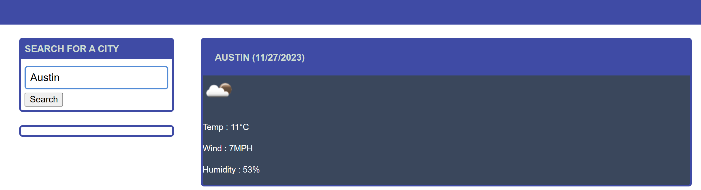
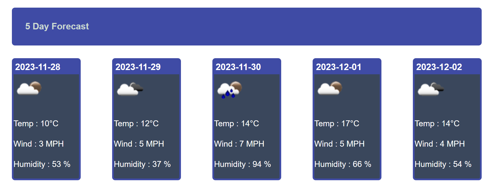
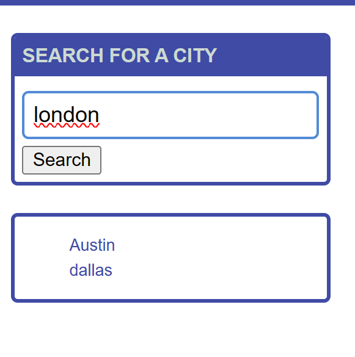

# Motivation

To develop weather dashboard that displays current and 5 days forecast for selected city.

# Table of Contents

1. [About the Project](#about-the-project)
2. [Screenshots](#screenshots)
3. [URL](#url)
4. [Author](#author)

## About the Project

- This application is developed using Server side API to fetch the weather data, Dayjs, Html, css and Javascript.
- User shall enter city name to get the current weather condition.
- The application displays city name, current date, an icon representation of weather conditions, the temperature, the humidity, and the wind speed
- The application also displays 5-day forecast for the selected city that displays the date, an icon representation of weather conditions, the temperature, the wind speed, and the humidity
- The application saves the city entered into teh search history

## Screenshots

## URL

# Author

Sangeetha Gnanavel, a Full Stack Developer having enormous experience in Front-end and Back-end application development.

**[Back to top](#table-of-contents)**
